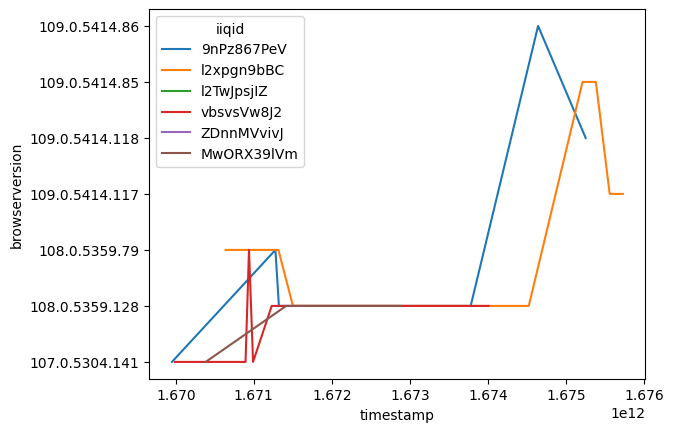
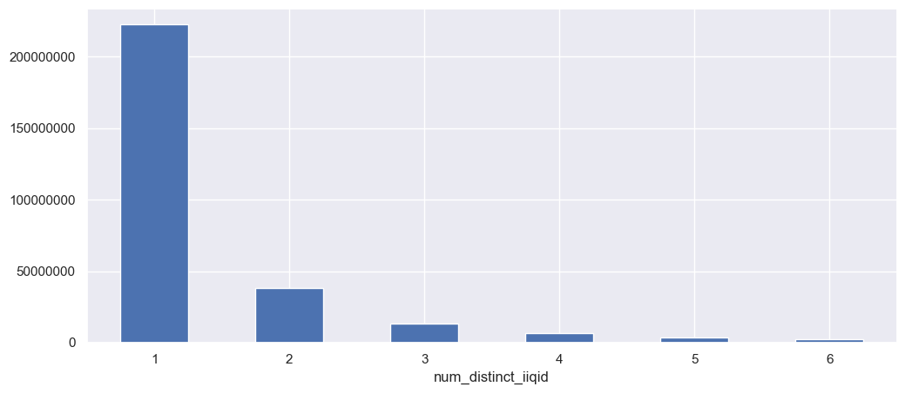
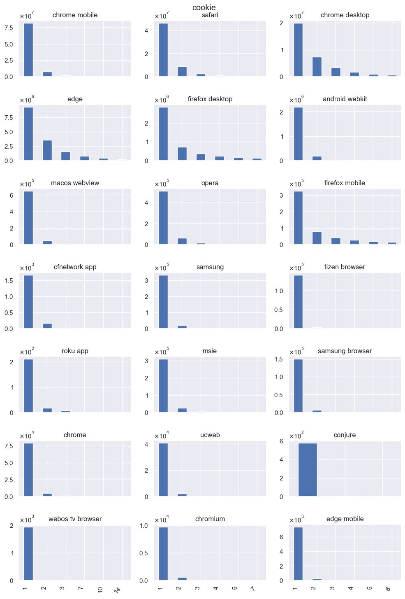
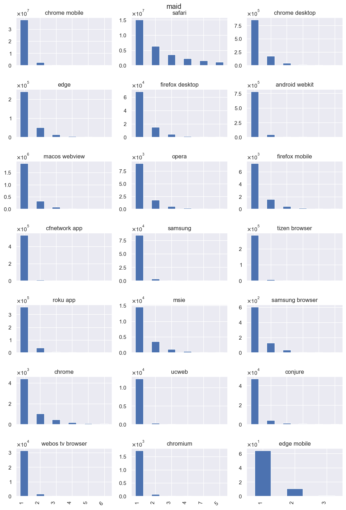
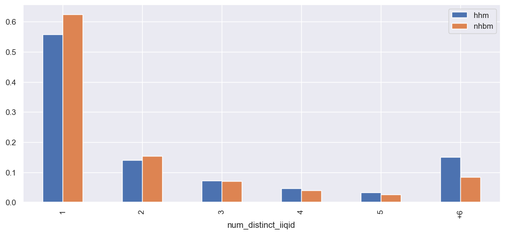

# Merging Cookies - Status Report

## First of all
First, to get our heads around the problem we explored some specific examples of houses which had several distinct cookies. Here is an example:  

  

As one can see the data is noisy, in this plot the version of the "red" cookies jumps up and then goes back down.

Next, explore the basic statistic: How many  distinct cookies are present in  each combination of household & user agent. 

We also present this for each of the popular browsers

We observe that: 
1. Most frequently, such combinations will only have 1 unique cookie present.
2. There are notable differences between different browsers.

At this point it had occurred to the data-science team that the data provided only included entities which had an house-hold id attached, meaning that any entity which could be clustered into such house-hold was filtered before reaching us.
We asked to change this behavior in order to prevent unpredictable biases.
After this was indeed modified we ran our analysis again. 
The result showed some change in the direction we anticipated but the effect was rather small.

## Perfect Cookies Sets
We examine the logical rules which defines when a set of cookies can be considered to be potentially merged.
As an initial direction we look for perfect merging, meaning those who have no conflicts whatsoever. In practice we know that some cases of cookies switching can be noisy and the simple rules won't apply to them in such straightforward manner.

For each combination of household+UA we again count the number of unique cookies, this time we test those cookies to see if, by logical rules only, they all can be merged. 
We get the following result:

![[mergeables.png]]

Again there is a different between various browsers. As expected the bigger the set of cookies the less likely they are to be mergable under this strict set of rules. 

Before relaxing the rules and allowing some noise in the system we wanted to test, under this strict setup,  what will be the accuracy of the merging. To do this we split the timeline, in the first part we ran the same merge test from before. We then "exposed" the rest of the timeline and checked whether what we thought could be merged actually survived the addition of a few more weeks of data. 
We hypothesized that accuracy would be affected by the "age" of the last cookie in the group. 